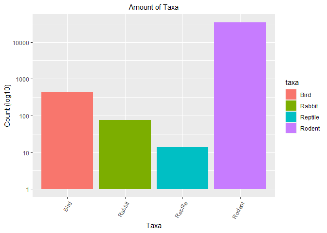
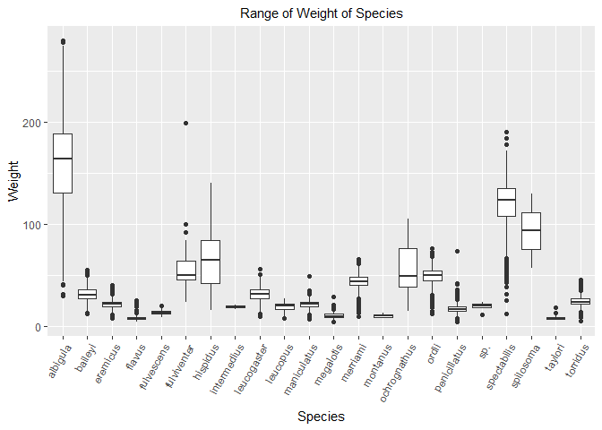
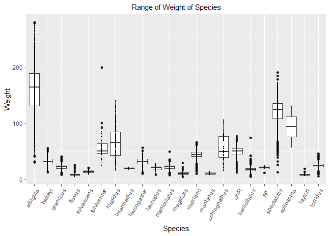

## Instructions
Answer the following questions and complete the exercises in RMarkdown. Please embed all of your code and push your final work to your repository. Your final lab report should be organized, clean, and run free from errors. Remember, you must remove the `#` for the included code chunks to run. Be sure to add your name to the author header above. For any included plots, make sure they are clearly labeled. You are free to use any plot type that you feel best communicates the results of your analysis.  

Make sure to use the formatting conventions of RMarkdown to make your report neat and clean!  

## Load the libraries

```r
library(tidyverse)
library(janitor)
library(here)
library(naniar)
```

## Desert Ecology
For this assignment, we are going to use a modified data set on [desert ecology](http://esapubs.org/archive/ecol/E090/118/). The data are from: S. K. Morgan Ernest, Thomas J. Valone, and James H. Brown. 2009. Long-term monitoring and experimental manipulation of a Chihuahuan Desert ecosystem near Portal, Arizona, USA. Ecology 90:1708.

```r
deserts <- read_csv(here("lab10", "data", "surveys_complete.csv"))
```

```
## 
## -- Column specification --------------------------------------------------------
## cols(
##   record_id = col_double(),
##   month = col_double(),
##   day = col_double(),
##   year = col_double(),
##   plot_id = col_double(),
##   species_id = col_character(),
##   sex = col_character(),
##   hindfoot_length = col_double(),
##   weight = col_double(),
##   genus = col_character(),
##   species = col_character(),
##   taxa = col_character(),
##   plot_type = col_character()
## )
```

1. Use the function(s) of your choice to get an idea of its structure, including how NA's are treated. Are the data tidy?  

```r
glimpse(deserts)
```

```
## Rows: 34,786
## Columns: 13
## $ record_id       <dbl> 1, 2, 3, 4, 5, 6, 7, 8, 9, 10, 11, 12, 13, 14, 15, ...
## $ month           <dbl> 7, 7, 7, 7, 7, 7, 7, 7, 7, 7, 7, 7, 7, 7, 7, 7, 7, ...
## $ day             <dbl> 16, 16, 16, 16, 16, 16, 16, 16, 16, 16, 16, 16, 16,...
## $ year            <dbl> 1977, 1977, 1977, 1977, 1977, 1977, 1977, 1977, 197...
## $ plot_id         <dbl> 2, 3, 2, 7, 3, 1, 2, 1, 1, 6, 5, 7, 3, 8, 6, 4, 3, ...
## $ species_id      <chr> "NL", "NL", "DM", "DM", "DM", "PF", "PE", "DM", "DM...
## $ sex             <chr> "M", "M", "F", "M", "M", "M", "F", "M", "F", "F", "...
## $ hindfoot_length <dbl> 32, 33, 37, 36, 35, 14, NA, 37, 34, 20, 53, 38, 35,...
## $ weight          <dbl> NA, NA, NA, NA, NA, NA, NA, NA, NA, NA, NA, NA, NA,...
## $ genus           <chr> "Neotoma", "Neotoma", "Dipodomys", "Dipodomys", "Di...
## $ species         <chr> "albigula", "albigula", "merriami", "merriami", "me...
## $ taxa            <chr> "Rodent", "Rodent", "Rodent", "Rodent", "Rodent", "...
## $ plot_type       <chr> "Control", "Long-term Krat Exclosure", "Control", "...
```


```r
naniar::miss_var_summary(deserts)
```

```
## # A tibble: 13 x 3
##    variable        n_miss pct_miss
##    <chr>            <int>    <dbl>
##  1 hindfoot_length   3348     9.62
##  2 weight            2503     7.20
##  3 sex               1748     5.03
##  4 record_id            0     0   
##  5 month                0     0   
##  6 day                  0     0   
##  7 year                 0     0   
##  8 plot_id              0     0   
##  9 species_id           0     0   
## 10 genus                0     0   
## 11 species              0     0   
## 12 taxa                 0     0   
## 13 plot_type            0     0
```

```r
summary(deserts)
```

```
##    record_id         month             day            year         plot_id     
##  Min.   :    1   Min.   : 1.000   Min.   : 1.0   Min.   :1977   Min.   : 1.00  
##  1st Qu.: 8964   1st Qu.: 4.000   1st Qu.: 9.0   1st Qu.:1984   1st Qu.: 5.00  
##  Median :17762   Median : 6.000   Median :16.0   Median :1990   Median :11.00  
##  Mean   :17804   Mean   : 6.474   Mean   :16.1   Mean   :1990   Mean   :11.34  
##  3rd Qu.:26655   3rd Qu.:10.000   3rd Qu.:23.0   3rd Qu.:1997   3rd Qu.:17.00  
##  Max.   :35548   Max.   :12.000   Max.   :31.0   Max.   :2002   Max.   :24.00  
##                                                                                
##   species_id            sex            hindfoot_length     weight      
##  Length:34786       Length:34786       Min.   : 2.00   Min.   :  4.00  
##  Class :character   Class :character   1st Qu.:21.00   1st Qu.: 20.00  
##  Mode  :character   Mode  :character   Median :32.00   Median : 37.00  
##                                        Mean   :29.29   Mean   : 42.67  
##                                        3rd Qu.:36.00   3rd Qu.: 48.00  
##                                        Max.   :70.00   Max.   :280.00  
##                                        NA's   :3348    NA's   :2503    
##     genus             species              taxa            plot_type        
##  Length:34786       Length:34786       Length:34786       Length:34786      
##  Class :character   Class :character   Class :character   Class :character  
##  Mode  :character   Mode  :character   Mode  :character   Mode  :character  
##                                                                             
##                                                                             
##                                                                             
## 
```

```r
head(deserts, n=10)
```

```
## # A tibble: 10 x 13
##    record_id month   day  year plot_id species_id sex   hindfoot_length weight
##        <dbl> <dbl> <dbl> <dbl>   <dbl> <chr>      <chr>           <dbl>  <dbl>
##  1         1     7    16  1977       2 NL         M                  32     NA
##  2         2     7    16  1977       3 NL         M                  33     NA
##  3         3     7    16  1977       2 DM         F                  37     NA
##  4         4     7    16  1977       7 DM         M                  36     NA
##  5         5     7    16  1977       3 DM         M                  35     NA
##  6         6     7    16  1977       1 PF         M                  14     NA
##  7         7     7    16  1977       2 PE         F                  NA     NA
##  8         8     7    16  1977       1 DM         M                  37     NA
##  9         9     7    16  1977       1 DM         F                  34     NA
## 10        10     7    16  1977       6 PF         F                  20     NA
## # ... with 4 more variables: genus <chr>, species <chr>, taxa <chr>,
## #   plot_type <chr>
```
**The data is tidy and is long**

2. How many genera and species are represented in the data? What are the total number of observations? Which species is most/ least frequently sampled in the study?

```r
deserts %>% 
  summarise(n_genera = n_distinct(genus), 
            n_species = n_distinct(species), 
            total_observations = n())
```

```
## # A tibble: 1 x 3
##   n_genera n_species total_observations
##      <int>     <int>              <int>
## 1       26        40              34786
```

```r
deserts %>% 
  group_by(genus, species) %>% 
  summarise(observations = n()) %>% 
  arrange(desc(observations))
```

```
## `summarise()` has grouped output by 'genus'. You can override using the `.groups` argument.
```

```
## # A tibble: 48 x 3
## # Groups:   genus [26]
##    genus           species      observations
##    <chr>           <chr>               <int>
##  1 Dipodomys       merriami            10596
##  2 Chaetodipus     penicillatus         3123
##  3 Dipodomys       ordii                3027
##  4 Chaetodipus     baileyi              2891
##  5 Reithrodontomys megalotis            2609
##  6 Dipodomys       spectabilis          2504
##  7 Onychomys       torridus             2249
##  8 Perognathus     flavus               1597
##  9 Peromyscus      eremicus             1299
## 10 Neotoma         albigula             1252
## # ... with 38 more rows
```

**Dipodomys merriami was most frequently sampled and Cnemidophorus tigris, Cnemidophorus uniparens, Crotalus scutalatus, Crotalus viridis, Sceloporus clarki, Spermophilus tereticaudus were all sampled the least (once).**

3. What is the proportion of taxa included in this study? Show a table and plot that reflects this count.

```r
deserts %>% 
  tabyl(taxa)
```

```
##     taxa     n      percent
##     Bird   450 0.0129362387
##   Rabbit    75 0.0021560398
##  Reptile    14 0.0004024608
##   Rodent 34247 0.9845052607
```


```r
deserts %>% 
  ggplot(aes(x=taxa, fill=taxa))+
  geom_bar()+
  scale_y_log10()+
  theme(axis.text.x = element_text(angle = 60, hjust = 1), plot.title = element_text(size = rel(1), hjust = 0.5))+
  labs(title = "Amount of Taxa", x = "Taxa", y="Count (log10)")
```

<!-- -->

4. For the taxa included in the study, use the fill option to show the proportion of individuals sampled by `plot_type.`

```r
deserts %>% 
  ggplot(aes(x=taxa, fill=plot_type))+
  geom_bar()+
  scale_y_log10()+
  theme(axis.text.x = element_text(angle = 60, hjust = 1), plot.title = element_text(size = rel(1), hjust = 0.5))+
  labs(title = "Amount of Taxa", x = "Taxa", y="Count (log10)")
```

<!-- -->

5. What is the range of weight for each species included in the study? Remove any observations of weight that are NA so they do not show up in the plot.

```r
deserts %>% 
  filter(weight != "NA") %>% 
  ggplot(aes(x=species, y= weight))+geom_boxplot()+
  theme(axis.text.x = element_text(angle = 60, hjust = 1), plot.title = element_text(size = rel(1), hjust = 0.5))+
  labs(title = "Range of Weight of Species", x = "Species", y="Weight")
```

<!-- -->

6. Add another layer to your answer from #5 using `geom_point` to get an idea of how many measurements were taken for each species.

```r
deserts %>% 
  filter(weight != "NA") %>% 
  ggplot(aes(x=species, y= weight))+
  geom_boxplot()+
  geom_point(size = 0.5)+
  theme(axis.text.x = element_text(angle = 60, hjust = 1), plot.title = element_text(size = rel(1), hjust = 0.5))+
  labs(title = "Range of Weight of Species", x = "Species", y="Weight")
```

<!-- -->

7. [Dipodomys merriami](https://en.wikipedia.org/wiki/Merriam's_kangaroo_rat) is the most frequently sampled animal in the study. How have the number of observations of this species changed over the years included in the study?

```r
names(deserts)
```

```
##  [1] "record_id"       "month"           "day"             "year"           
##  [5] "plot_id"         "species_id"      "sex"             "hindfoot_length"
##  [9] "weight"          "genus"           "species"         "taxa"           
## [13] "plot_type"
```


```r
deserts %>% 
  filter(species == "merriami") %>% 
  ggplot(aes(x=year))+
  geom_bar()+
  theme(axis.text.x = element_text(angle = 60, hjust = 1), plot.title = element_text(size = rel(1), hjust = 0.5))+
  labs(title = "Number of Observations of Dipodomys merriami per Year", x = "Year")
```

<!-- -->

8. What is the relationship between `weight` and `hindfoot` length? Consider whether or not over plotting is an issue.

```r
deserts %>% 
  filter(weight != "NA", hindfoot_length != "NA") %>% 
  ggplot(aes(x=weight, y= hindfoot_length))+
  geom_point(na.rm=T)+
  theme(axis.text.x = element_text(angle = 60, hjust = 1), plot.title = element_text(size = rel(1), hjust = 0.5))+
  labs(title = "Hindfoot Length vs Weight", x = "Weight", y="Hindfoot Length")
```

<!-- -->
**This plot is very messy! So many points on the graph are overlapping, this is not nice to look at. Over plotting is definitely an issue here!**


```r
deserts %>% 
  filter(weight != "NA", hindfoot_length != "NA") %>% 
  ggplot(aes(x=weight, y= hindfoot_length))+
  geom_jitter(na.rm = T, size = 0.2, alpha = 0.4)+
  theme(axis.text.x = element_text(angle = 60, hjust = 1), plot.title = element_text(size = rel(1), hjust = 0.5))+
  labs(title = "Hindfoot Length vs Weight", x = "Weight", y="Hindfoot Length")
```

<!-- -->
**This makes it a little better but there are still some over plotting issues**

9. Which two species have, on average, the highest weight? Once you have identified them, make a new column that is a ratio of `weight` to `hindfoot_length`. Make a plot that shows the range of this new ratio and fill by sex.

```r
deserts %>% 
  filter(weight != 'NA') %>% 
  group_by(genus, species) %>% 
  summarise(mean_weight = mean(weight)) %>% 
  arrange(desc(mean_weight))
```

```
## `summarise()` has grouped output by 'genus'. You can override using the `.groups` argument.
```

```
## # A tibble: 25 x 3
## # Groups:   genus [10]
##    genus        species      mean_weight
##    <chr>        <chr>              <dbl>
##  1 Neotoma      albigula           159. 
##  2 Dipodomys    spectabilis        120. 
##  3 Spermophilus spilosoma           93.5
##  4 Sigmodon     hispidus            73.1
##  5 Sigmodon     fulviventer         58.9
##  6 Sigmodon     ochrognathus        55.4
##  7 Dipodomys    ordii               48.9
##  8 Dipodomys    merriami            43.2
##  9 Chaetodipus  baileyi             31.7
## 10 Onychomys    leucogaster         31.6
## # ... with 15 more rows
```

**Neotoma albigula and Dipodomys spectabilis have the highest average weight**

```r
deserts2 <- deserts %>% 
  mutate(weight_to_hindfoot_ratio = (weight/hindfoot_length))
deserts2
```

```
## # A tibble: 34,786 x 14
##    record_id month   day  year plot_id species_id sex   hindfoot_length weight
##        <dbl> <dbl> <dbl> <dbl>   <dbl> <chr>      <chr>           <dbl>  <dbl>
##  1         1     7    16  1977       2 NL         M                  32     NA
##  2         2     7    16  1977       3 NL         M                  33     NA
##  3         3     7    16  1977       2 DM         F                  37     NA
##  4         4     7    16  1977       7 DM         M                  36     NA
##  5         5     7    16  1977       3 DM         M                  35     NA
##  6         6     7    16  1977       1 PF         M                  14     NA
##  7         7     7    16  1977       2 PE         F                  NA     NA
##  8         8     7    16  1977       1 DM         M                  37     NA
##  9         9     7    16  1977       1 DM         F                  34     NA
## 10        10     7    16  1977       6 PF         F                  20     NA
## # ... with 34,776 more rows, and 5 more variables: genus <chr>, species <chr>,
## #   taxa <chr>, plot_type <chr>, weight_to_hindfoot_ratio <dbl>
```


```r
deserts2 %>% 
  filter(species == "albigula"| species == "spectabilis") %>% 
  ggplot(aes(x=species, y=weight_to_hindfoot_ratio, fill=sex))+
  geom_boxplot(na.rm=T)+
  theme(axis.text.x = element_text(angle = 60, hjust = 1), plot.title = element_text(size = rel(1), hjust = 0.5))+
  labs(title = "Weight to Hindfoot Length Ratio in N. albigula and D. spectabilis", x = "Species", y="Weight to Hindfoot Length Ratio")
```

<!-- -->

10. Make one plot of your choice! Make sure to include at least two of the aesthetics options you have learned.

```r
names(deserts)
```

```
##  [1] "record_id"       "month"           "day"             "year"           
##  [5] "plot_id"         "species_id"      "sex"             "hindfoot_length"
##  [9] "weight"          "genus"           "species"         "taxa"           
## [13] "plot_type"
```

```r
deserts %>% 
  filter(weight!="NA") %>% 
  ggplot(aes(x=species, fill=sex))+geom_bar(position = "dodge")+
  scale_y_log10()+
  theme(axis.text.x = element_text(angle = 60, hjust = 1), plot.title = element_text(size = rel(1), hjust = 0.5))+
  labs(title = "Number of Males and Females per Species", x = "Species", y="Count (log10)")
```

<!-- -->

## Push your final code to GitHub!
Please be sure that you check the `keep md` file in the knit preferences. 
