## Learning Goals
*At the end of this exercise, you will be able to:*    
1. Adjust the aesthetics of plots in ggplot using `themes`, `RColorBrewer`, and `paletteer.`  
2. Use faceting to produce multi-panel plots.  

## Group project  
We will meet in our groups today to compare the data sets that we found. You should try to pick the data set that you think will be most appropriate; i.e. does it have a mix of variables, does it have a story to tell? Once you have a data set, think about the kinds of questions you might ask. Remember, in the end you will need to deliver a 5-6 minute presentation of your work. If you need help, please ask!  

## Resources
- [ggplot2 cheatsheet](https://www.rstudio.com/wp-content/uploads/2015/03/ggplot2-cheatsheet.pdf)
- [R for Data Science](https://r4ds.had.co.nz/)
- [R Cookbook](http://www.cookbook-r.com/)
- [`ggplot` themes](https://ggplot2.tidyverse.org/reference/ggtheme.html)
- [Rebecca Barter `ggplot` Tutorial](http://www.rebeccabarter.com/blog/2017-11-17-ggplot2_tutorial/)
- [R Color Brewer](http://colorbrewer2.org/#type=sequential&scheme=BuGn&n=3)

## Load the libraries

```r
library(tidyverse)
library(RColorBrewer)
library(paletteer)
library(janitor)
library(here)
```


```r
options(scipen=999) #cancels the use of scientific notation for the session
```

## Data
For this tutorial, we will use:  
[Homerange](http://datadryad.org/resource/doi:10.5061/dryad.q5j65/1). The data are from: Tamburello N, Cote IM, Dulvy NK (2015) Energy and the scaling of animal space use. The American Naturalist 186(2):196-211. http://dx.doi.org/10.1086/682070.  

```r
homerange <- read_csv(here("lab11", "data", "Tamburelloetal_HomeRangeDatabase.csv"))
```

## ggplot themes
There are many option to change the theme of your plots. Have a look [here](https://www.datanovia.com/en/blog/ggplot-themes-gallery/) for some excellent examples. I am going to build a basic plot here and then use it throughout to illustrate the themes.

```r
p <- homerange %>% 
  ggplot(aes(x=taxon, fill=trophic.guild))+
  geom_bar(na.rm=T, position="dodge")+theme_linedraw()
```


```r
p+theme_linedraw()+
  theme(axis.text.x = element_text(angle = 60, hjust=1))+
  labs(title = "Observations by Taxon in Homerange Data",
       x = NULL,
       y= "n",
       fill= "Trophic Guild")
```

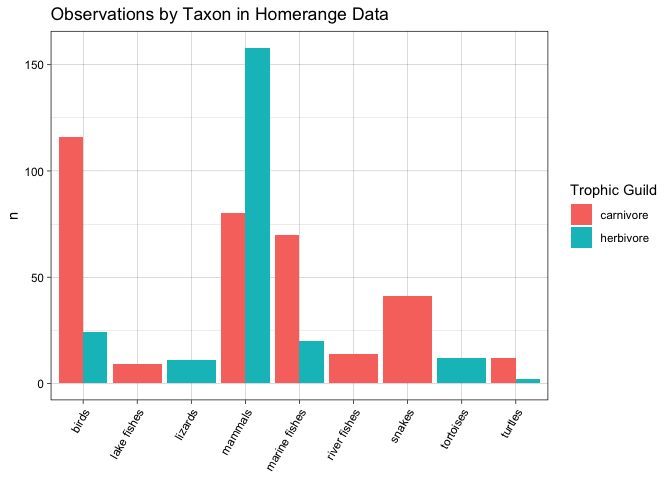<!-- -->

```r
p+theme_classic()
```

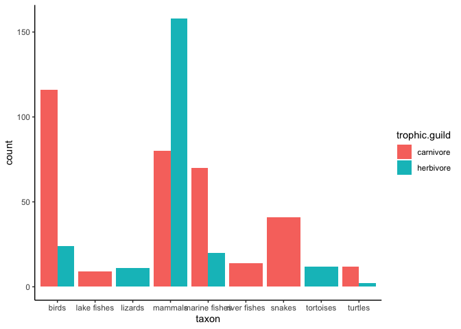<!-- -->

## Legends
There are lots of options to manipulate legends. Have a look [here](http://www.sthda.com/english/wiki/ggplot2-legend-easy-steps-to-change-the-position-and-the-appearance-of-a-graph-legend-in-r-software).

```r
p+theme_linedraw()+
  theme(legend.position = "bottom", #legend.position = 'none' gets rid of the legend
        axis.text.x = element_text(angle = 60, hjust=1))+
  labs(title = "Observations by Taxon in Homerange Data",
       x = NULL,
       y= "n",
       fill= "Trophic Guild")
```

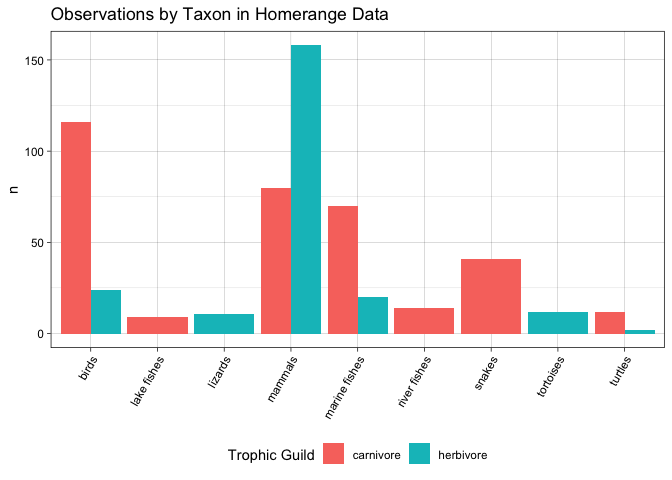<!-- -->

## Not enough? [ggthemes](https://yutannihilation.github.io/allYourFigureAreBelongToUs/)

```r
#install.packages("ggthemes")
library(ggthemes)
```

Here is a list of the `ggthemes`

```r
ls("package:ggthemes")[grepl("theme_", ls("package:ggthemes"))]
```

```
##  [1] "theme_base"            "theme_calc"            "theme_clean"          
##  [4] "theme_economist"       "theme_economist_white" "theme_excel"          
##  [7] "theme_excel_new"       "theme_few"             "theme_fivethirtyeight"
## [10] "theme_foundation"      "theme_gdocs"           "theme_hc"             
## [13] "theme_igray"           "theme_map"             "theme_pander"         
## [16] "theme_par"             "theme_solarized"       "theme_solarized_2"    
## [19] "theme_solid"           "theme_stata"           "theme_tufte"          
## [22] "theme_wsj"
```


```r
p+ theme_tufte()+
  theme(legend.position = "bottom",
        axis.text.x = element_text(angle = 60, hjust=1))+
  labs(title = "Observations by Taxon in Homerange Data",
       x = NULL,
       y= "n",
       fill= "Trophic Guild")
```

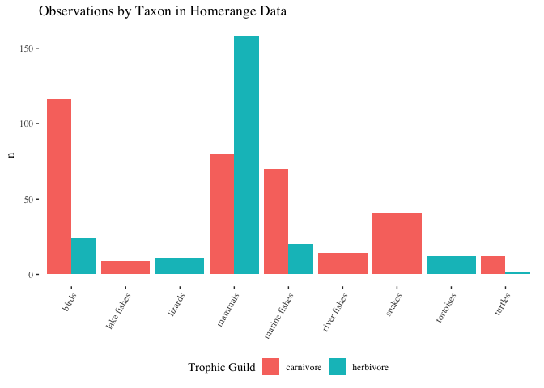<!-- -->

## RColorBrewer
The default colors used by ggplot are often uninspiring. They don't make plots pop out in presentations or publications, and you may want to use a customized palette to make things visually consistent.  

Access the help for `RColorBrewer`.

```r
?RColorBrewer
```

The thing to notice is that there are three different palettes: 1) sequential, 2) diverging, and 3) qualitative. Within each of these there are several selections. You can bring up the colors by using `display.brewer.pal()`. Specify the number of colors that you want and the palette name.

```r
display.brewer.pal(8,"PRGn")
```

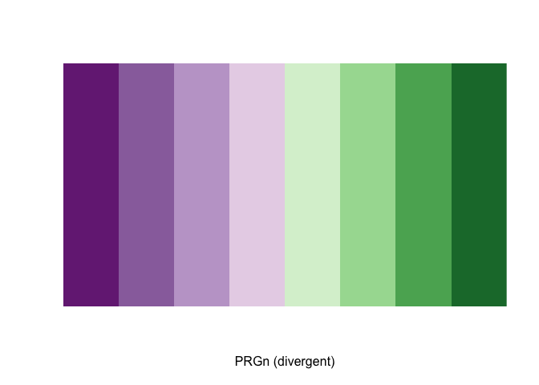<!-- -->

The [R Color Brewer](http://colorbrewer2.org/#type=sequential&scheme=BuGn&n=3) website is very helpful for getting an idea of the color palettes. To make things easy, use these two guidelines:

+`scale_colour_brewer()` is for points  
+`scale_fill_brewer()` is for fills  

Here I chose the `Paired` palette. Take a moment and experiment with other options.

```r
p+scale_fill_brewer(palette = "Set1")+
  theme(legend.position = "bottom",
        axis.text.x = element_text(angle = 60, hjust=1))+
  labs(title = "Observations by Taxon in Homerange Data",
       x = NULL,
       y= "n",
       fill= "Trophic Guild")
```

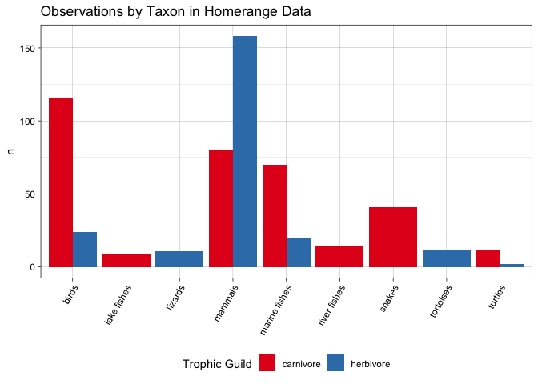<!-- -->

## Manually Setting Colors
You can also use `paleteer` to build a custom palette for consistency. To access the `paleteer` collection, I add it to a new object.

```r
colors <- paletteer::palettes_d_names
view(colors)
```

Now we can display the palettes. Assign the palette to `my_palette` and then build this base R bar plot. There are a lot of options; `paleteer` is a collection of popular palettes. I really like the [`ggsci` package] (https://cran.r-project.org/web/packages/ggsci/vignettes/ggsci.html)

```r
my_palette <- paletteer_d("ggsci::springfield_simpsons")
```

base r command shows you what the colors look like:


```r
barplot(rep(1,14), axes=FALSE, col=my_palette)
```

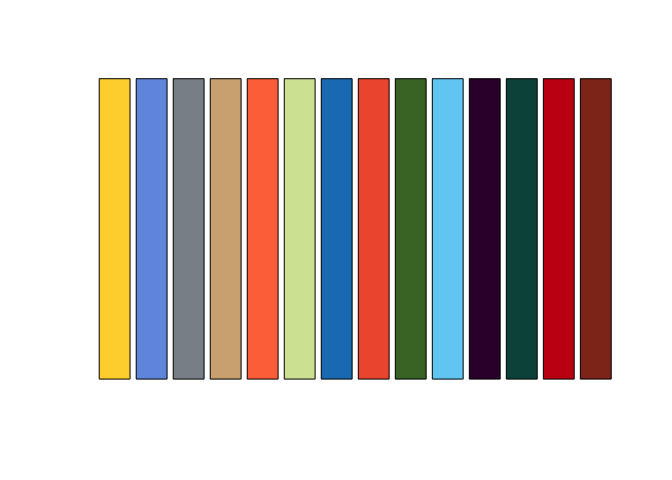<!-- -->

Now we just identify `my_palette` as part of `scale_fill_manual()`

```r
p+scale_fill_manual(values=my_palette)+
  theme(legend.position = "bottom",
        axis.text.x = element_text(angle = 60, hjust=1))+
  labs(title = "Observations by Taxon in Homerange Data",
       x = NULL,
       y= "n",
       fill= "Trophic Guild")
```

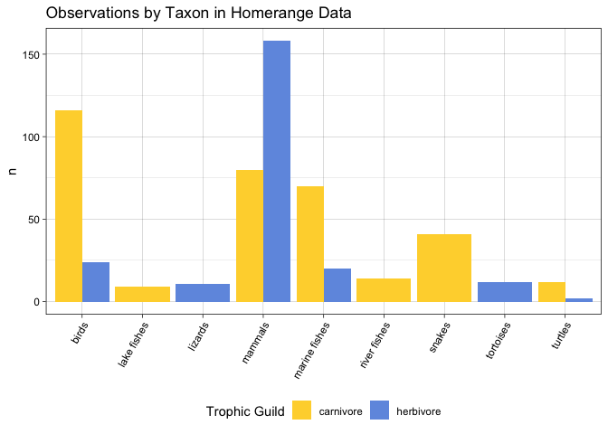<!-- -->

## Adjusting the x and y limits
There are many options for adjusting the x and y axes. For details, look over examples in the [R Cookbook](http://www.cookbook-r.com/). To adjust limits, we can use the `xlim` and `ylim` commands. When you do this, any data outside the specified ranges are not plotted.

```r
homerange %>% 
  ggplot(aes(x = log10.mass, y = log10.hra, color = locomotion)) +
  geom_point() +
  xlim(0, 4) +
  ylim(1, 6)
```

```
## Warning: Removed 175 rows containing missing values (geom_point).
```

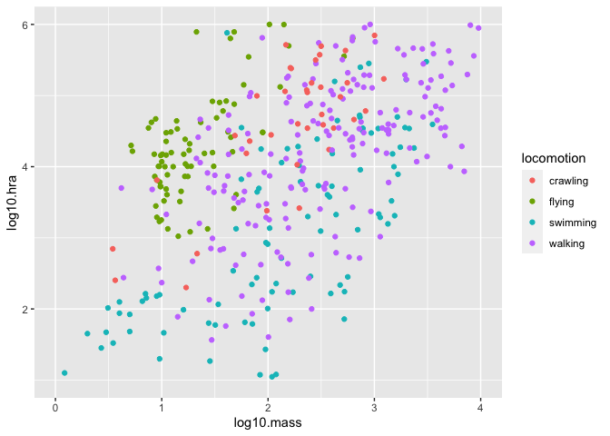<!-- -->

## Practice
1. Revisit the relationship between mass and homerange using a scatterplot, but color the points by taxonomic class using a custom color theme.

```r
homerange %>% 
  ggplot(aes(x=log10.mass, y=log10.hra, color=class))+
  geom_point()+
  scale_color_brewer(palette="PiYG")
```

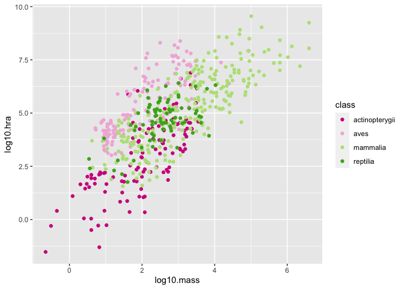<!-- -->

2. Build bar plots that show the representation by taxonomic class with carnivores and herbivores. Try using a color theme that matches your scatterplot to keep everything consistent.

```r
homerange %>% 
  ggplot(aes(x=trophic.guild, y=class, fill=class))+
  geom_col(position="dodge", alpha=0.75, color="black")+
  scale_fill_brewer(palette="Dark2")
```

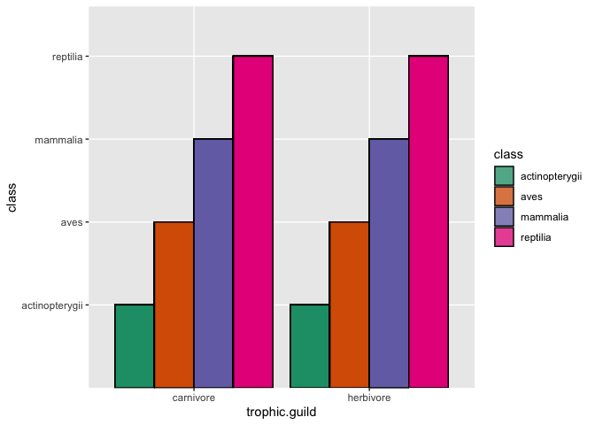<!-- -->

## Faceting: `facet_wrap()`
[Faceting](https://ggplot2-book.org/facet.html) is one of the amazing features of ggplot. It allows us to make multi-panel plots for easy comparison. Here, I am making histograms of log10.mass for every taxon. We read the `~` in the `facet_wrap()` layer as `by`. The bin number doesn't work for every taxon, but it is enough to get the idea.

```r
p2 <- homerange %>% 
  ggplot(aes(x = log10.mass)) +
  geom_density()
p2
```

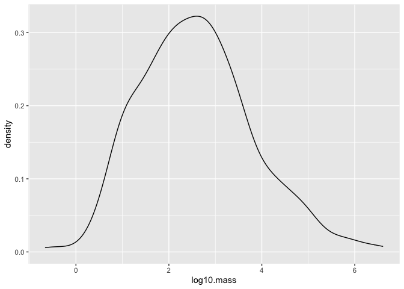<!-- -->


```r
p2+ facet_wrap(~class)
```

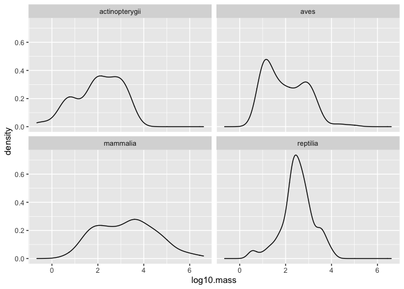<!-- -->

## Faceting: `facet_grid()`
As you can imagine, there are lots of options for faceting. Another useful facet type is `facet_grid`. 

```r
p2+facet_grid(locomotion~class)
```

<!-- -->
##Printing 

There are many options to export plots for use outside of R. Here is the basic code to do export. This exports plot p2 as a pdf.

```r
pdf("homerange.pdf")
p2
dev.off()
```

```
## quartz_off_screen 
##                 2
```

## That's it, let's take a break!   

-->[Home](https://jmledford3115.github.io/datascibiol/)
