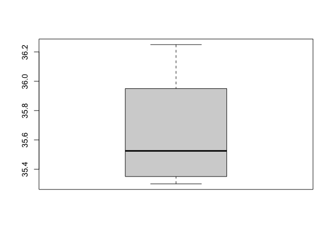

## Instructions
Answer the following questions and complete the exercises in RMarkdown. Please embed all of your code and push your final work to your repository. Your final lab report should be organized, clean, and run free from errors. Remember, you must remove the `#` for the included code chunks to run. Be sure to add your name to the author header above.  

Make sure to use the formatting conventions of RMarkdown to make your report neat and clean!  

1. What is a vector in R?  
Vectors are a type of data structure in R. They are a way of organizing data in R. They are an ordered list of numbers or characters.

2. What is a data matrix in R?  
A data matrix (another data structure) is a series of stacked vectors, similar to a data table.

3. Below are data collected by three scientists (Jill, Steve, Susan in order) measuring temperatures of eight hot springs. Run this code chunk to create the vectors.  

```r
spring_1 <- c(36.25, 35.40, 35.30)
spring_2 <- c(35.15, 35.35, 33.35)
spring_3 <- c(30.70, 29.65, 29.20)
spring_4 <- c(39.70, 40.05, 38.65)
spring_5 <- c(31.85, 31.40, 29.30)
spring_6 <- c(30.20, 30.65, 29.75)
spring_7 <- c(32.90, 32.50, 32.80)
spring_8 <- c(36.80, 36.45, 33.15)
```

4. Build a data matrix that has the springs as rows and the columns as scientists. 

Create object `temperatures` that combines all of the vectors 

```r
temperatures <- c(spring_1, spring_2, spring_3, spring_4, spring_5, spring_6, spring_7, spring_8)
temperatures
```

```
##  [1] 36.25 35.40 35.30 35.15 35.35 33.35 30.70 29.65 29.20 39.70 40.05 38.65
## [13] 31.85 31.40 29.30 30.20 30.65 29.75 32.90 32.50 32.80 36.80 36.45 33.15
```

Create matrix and print it

```r
temperature_matrix <- matrix(temperatures, nrow = 8, byrow = T)
temperature_matrix
```

```
##       [,1]  [,2]  [,3]
## [1,] 36.25 35.40 35.30
## [2,] 35.15 35.35 33.35
## [3,] 30.70 29.65 29.20
## [4,] 39.70 40.05 38.65
## [5,] 31.85 31.40 29.30
## [6,] 30.20 30.65 29.75
## [7,] 32.90 32.50 32.80
## [8,] 36.80 36.45 33.15
```

5. The names of the springs are 1.Bluebell Spring, 2.Opal Spring, 3.Riverside Spring, 4.Too Hot Spring, 5.Mystery Spring, 6.Emerald Spring, 7.Black Spring, 8.Pearl Spring. Name the rows and columns in the data matrix. Start by making two new vectors with the names, then use `colnames()` and `rownames()` to name the columns and rows.

Make the row and column titles:

```r
springs <- c("Bluebell Spring", "Opal Spring", "Riverside Spring", "Too Hot Spring", "Mystery Spring", "Emerald Spring", "Black Spring", "Pearl Spring")
scientists <- c("Jill", "Steve", "Susan")
```

Add row and column titles to the matrix:

```r
rownames(temperature_matrix) <- springs
colnames(temperature_matrix)  <- scientists
temperature_matrix
```

```
##                   Jill Steve Susan
## Bluebell Spring  36.25 35.40 35.30
## Opal Spring      35.15 35.35 33.35
## Riverside Spring 30.70 29.65 29.20
## Too Hot Spring   39.70 40.05 38.65
## Mystery Spring   31.85 31.40 29.30
## Emerald Spring   30.20 30.65 29.75
## Black Spring     32.90 32.50 32.80
## Pearl Spring     36.80 36.45 33.15
```

6. Calculate the mean temperature of all three springs.


```r
Average <- rowMeans(temperature_matrix)
Average
```

```
##  Bluebell Spring      Opal Spring Riverside Spring   Too Hot Spring 
##         35.65000         34.61667         29.85000         39.46667 
##   Mystery Spring   Emerald Spring     Black Spring     Pearl Spring 
##         30.85000         30.20000         32.73333         35.46667
```

7. Add this as a new column in the data matrix.  
`cbind()` adds columns and `rbind()` adds rows

```r
temperature_matrix <- cbind(temperature_matrix, Average)
temperature_matrix
```

```
##                   Jill Steve Susan  Average
## Bluebell Spring  36.25 35.40 35.30 35.65000
## Opal Spring      35.15 35.35 33.35 34.61667
## Riverside Spring 30.70 29.65 29.20 29.85000
## Too Hot Spring   39.70 40.05 38.65 39.46667
## Mystery Spring   31.85 31.40 29.30 30.85000
## Emerald Spring   30.20 30.65 29.75 30.20000
## Black Spring     32.90 32.50 32.80 32.73333
## Pearl Spring     36.80 36.45 33.15 35.46667
```

8. Show Susan's value for Opal Spring only.

```r
temperature_matrix[2,3]
```

```
## [1] 33.35
```

9. Calculate the mean for Jill's column only.  

```r
Jill <- temperature_matrix[,1]
mean(Jill)
```

```
## [1] 34.19375
```

10. Use the data matrix to perform one calculation or operation of your interest.

```r
boxplot(temperature_matrix[1,])
```

<!-- -->

```r
temperature_matrix[3,1] < temperature_matrix[1,2]
```

```
## [1] TRUE
```


## Push your final code to GitHub!
Please be sure that you check the `keep md` file in the knit preferences.  
